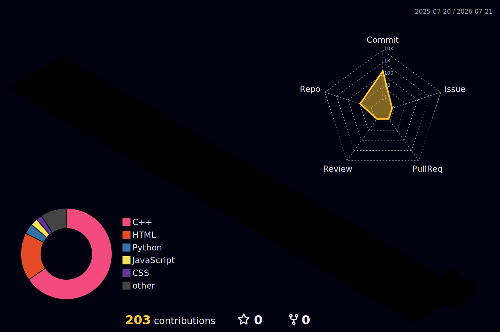

 

## 👋 About Me

Passionate **AI/ML Engineer** and **Data Analyst** with hands-on experience building intelligent, data-driven systems — from predictive models to end-to-end ML pipelines. Skilled at turning raw data into actionable insights and deploying models that solve real business problems.

- 🤖 &nbsp;Currently building machine learning models and data pipelines for real-world applications
- 💻 &nbsp;All of my projects live at **[My Projects](https://github.com/mishtee-khanna?tab=repositories)**
- 💬 &nbsp;Ask me about **Machine Learning · Data Analysis · Python · SQL · C++**
- 📫 &nbsp;Reach me at **mishtikhanna07@gmail.com**
- ⚡ &nbsp;Fun fact: I find patterns in data almost as fast as I finish a cup of chai

 

## 🛠️ Tech Stack

**Languages**
 

**ML / Data**
 

**Tools**
 

 

## 🏙️ 3D Contribution Graph

 

