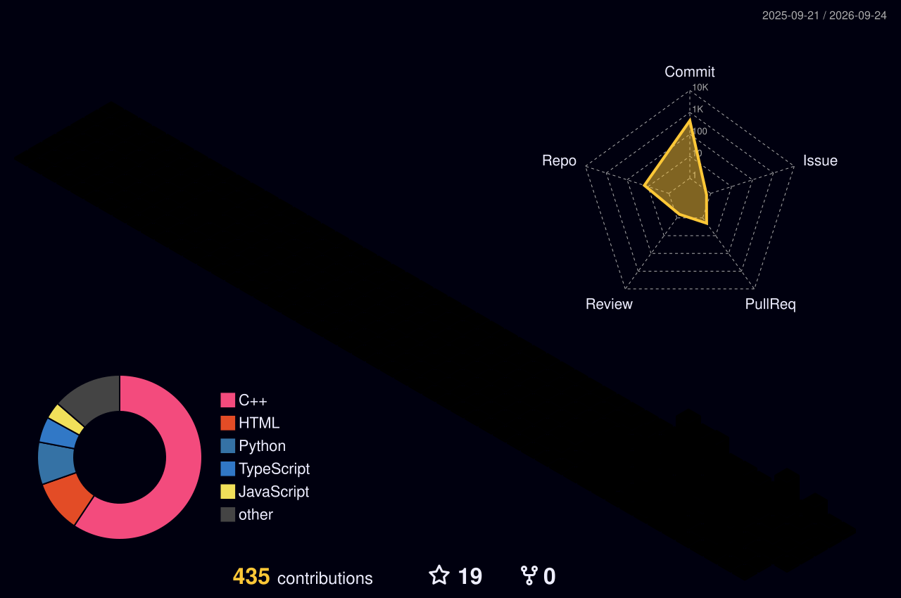

 

  &nbsp;&nbsp;&nbsp;&nbsp;
  &nbsp;&nbsp;&nbsp;&nbsp;
  &nbsp;&nbsp;&nbsp;&nbsp;
  &nbsp;&nbsp;&nbsp;&nbsp;
  

 

## 👋 About Me

### ✨ I build things with code, data & curiosity.

I'm a **Computer Science student** interested in **AI/ML, Data Analytics and Software Development**. I enjoy taking a problem from **idea → data → model → working solution** and learning something new along the way.

 

**🤖 AI & Machine Learning**  
Building predictive models and AI-powered applications that solve practical problems.

**📊 Data & Analytics**  
Exploring data, finding patterns and turning numbers into useful insights.

**💻 Development & Problem Solving**  
Working with Python, C++, SQL and DSA while building projects that turn ideas into real software.

 

**Currently building:** AI/ML projects · Data pipelines · Intelligent applications

  

`Learn` → `Build` → `Experiment` → `Improve` → `Repeat` 🚀

  

☕ *Fun fact: I find patterns in data almost as fast as I finish a cup of chai.*

 

## 🛠️ Tech Stack

| 💻 **Languages** | 📊 **ML / Data** | 🧰 **Tools** |
|:---:|:---:|:---:|
|  |      |  |
| **Python · C · C++ · C# · Java · MySQL** | **NumPy · Pandas · Matplotlib · Scikit-learn · Seaborn** | **Jupyter · Git · GitHub · VS Code** |

 

## 📊 GitHub Activity

  

 

## 🏙️ 3D Contribution Graph

 

